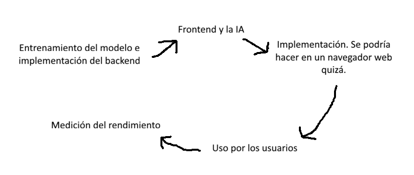

# Solución elegida:

Se ha elegido la **solución 2**, es más fácil de implementar y tiene un ciclo más sencillo. Se podría medir *su eficiencia energética e impacto medioambiental* mediante los recursos que gasta cada dispositivo que usa el servicio más [el coste menor de los servidores comparado a data centers de IA](https://www.iea.org/reports/energy-and-ai/energy-demand-from-ai).

